# Game Programming F21 Project - Tetris

## ✒️ Description

In this puzzle game, there will be shapes falling from the top of the world. The shapes are formed using multiple small square blocks and the shapes are of different forms. The player has to strategically place those falling shapes on the ground in the goal to make a connecting horizontal line of small square blocks. Once a line is formed, that line gets removed and the blocks on top of that line falls down. Points are awarded for each line formed. Once a certain amount of points are reached, the level is increased. Higher the level, faster the shapes will fall giving less time for the player to think and act. While the shape is falling, the player will be able to move it left and right, and make it fall faster. The player will also have the option to instantly make the shape fall to the ground, and to help them visualize where exactly the shape will end up on instant fall, there is a "ghost" preview showing exactly that. Another possibility for the player is to place the falling shape in "hold" and retrieve it at a later moment. Once the placed shapes build a tower exceeding top of the world (line where shapes start to fall), the game ends and the score is shown to the player. If the score is among the top five highscores, the player is asked for his nickname and his score gets placed in the highscore leaderboard. 

Also, the player's curent score & current level is always displayed somewhere outside the playing area (either at the **top right** or **top left**). Other information displayed outside the playing area is the next shape that will fall and the shape that is currently on hold. 

## 🕹️ Gameplay

Game begins by 1 shape falling from the sky. As the shape is falling, the player can do multiple things:
1. Move the falling shape one block to the left using the `left arrow key`.
2. Move the falling shape one block to the right using the `right arrow key`.
3. Rotate the falling shape using the `up arrow key`.
4. Make the shape fall faster using the `down arrow key`.
5. Make the shape instantly fall using the `space bar`.
6. Put the falling shape in the "holding" area using the `C key`.

The holding of a shape works in the following way:
1. The player clicks `C` when a shape is falling and there is nothing in the holding area.
2. That falling shape will be placed in the holding area and a new shape will start falling.
3. The player clicks `C` again when a shape is falling and a shape is already placed in the holding area.
4. The falling shape will be placed in the holding area and the shape already placed in the holding area will be removed from that area and start falling from the top.

There are two ways the player can gain points:
1. The main way is to form a horizontal line of blocks by placing the shapes strategically.
2. A second way is to make the falling shapes fall faster by clicking the down arrow key. Since this is just a way to increase the level faster if the player finds the first few levels too easy, the points awarded by this function are low. Awarding points by this method would be something along the lines of every **1** block of distance covered while pressing **Down**, the player earns **X** amount of points.
3. A third way is to make the falling shape instantly fall by clicking the space bar. Points awarded by this method will also be low and will be similar to the 2nd method. Awarding points by this method would be something along the lines of every **1** block of distance skiped will give the player **X * 2** amount of points. X being the number of points per block from method 2.

Once the falling shape touches a already placed block, that falling shape stops falling and gets placed at that position. Once a shape is placed, another one starts falling from the sky and so on until the player reaches a high enough level that he cannot handle the speed at which the blocks are falling and is unable to place the falling blocks well making them pile up to the sky. Once the blocks do pile up to the sky, the game is over.

Throughout the game, the player can click `M` on their keyboard at any time to mute all game sounds. Clicking `M` again when the game is already muted will enable all game sounds.

## 📃 Requirements

1. The player shall move the falling shape left or right.
2. The player shall rotate the falling shape.
3. The player shall not move the already placed blocks.
4. The player shall not rotate the already placed blocks.
5. The system shall make 1 shape fall at a time.
6. The system shall only make a block fall in the playing area.
7. The system shall clearly show what is the playing area.
8. The system shall always show and keep up to date the player's score.
9. The system shall always show and keep up to date the player's level.
10. The system shall show the next shape to fall.
11. The system shall set the falling speed of shapes depending on the level number. (Higher the level, faster the speed)
12. The system shall prevent falling shape to be moved outside the playing area.
13. The system shall place the falling shape once it touches an already placed block.
14. The system shall assign points to the player on each formed line of blocks.
15. The system shall remove each formed line of blocks.
16. After a formed line removal, the system should move down all the blocks at the top of that line by 1 block.
17. The system shall make another shape fall from the sky after the current falling shape has been placed.
18. The player shall speed up the fall of a falling shape.
19. The system shall award the player a small amount of points for speeding up the fall of a falling shape.
20. The system shall keep track of all of the player's highscores.
21. The game shall have a title screen with three options: 1 that leads to the actual game, 1 that leads to the game instructions and 1 that leads to the highscore board.
22. The game shall have a game over screen with the high score board displayed.
23. On game over, if the player manages to hit a highscore, the system shall ask him his nickname to display his score on the highscore board.
24. The player shall make the shape instantly fall to the ground.
25. The system shall award the player some points for making the shape instantly fall.
26. The player shall hold a falling shape and retrieve it later.
27. The system shall only allow one shape at a time in the holding area.
28. The system shall show a ghost preview of where the shape will land on instant fall.

### 🤖 State Diagram

#### 🎮 Game State
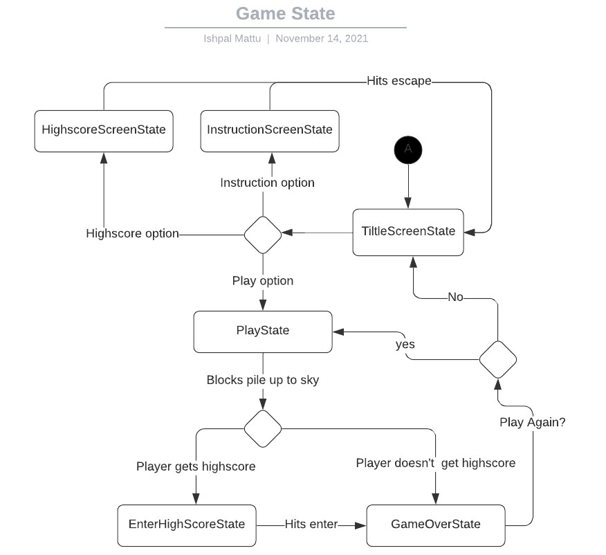

### 🗺️ Class Diagram
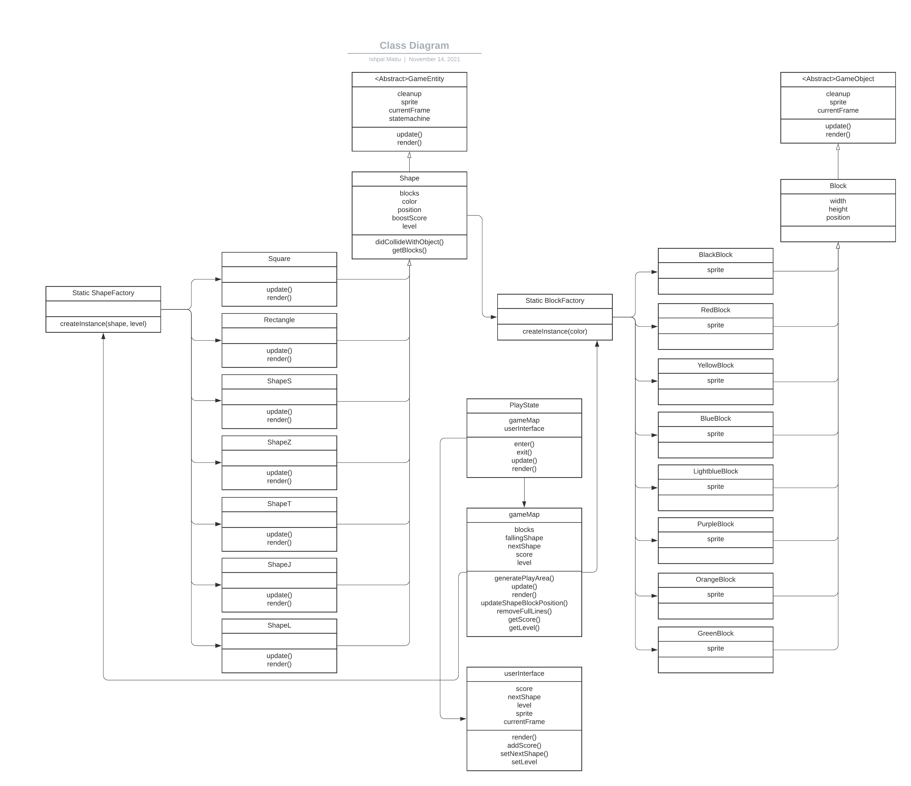

### 🧵 Wireframes
#### Main Menu
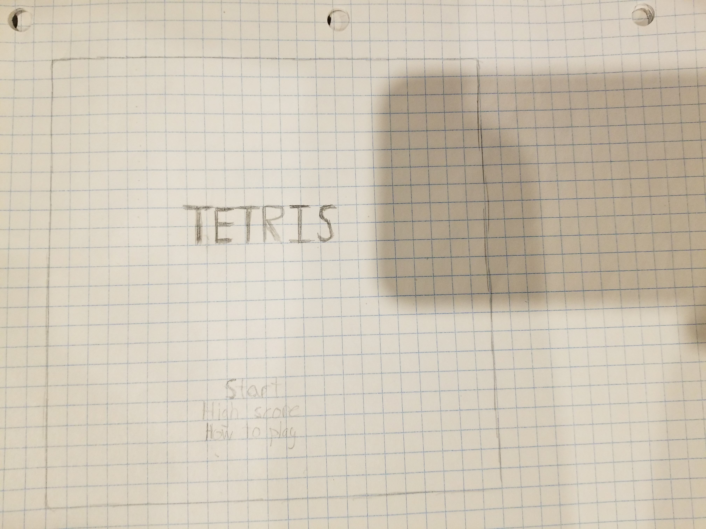
- _Start_ will navigate to the main game
- _High Score_ will navigate to the high score screen
- _How to play_ will navigate to the how-to-play screen

#### High Score Screen
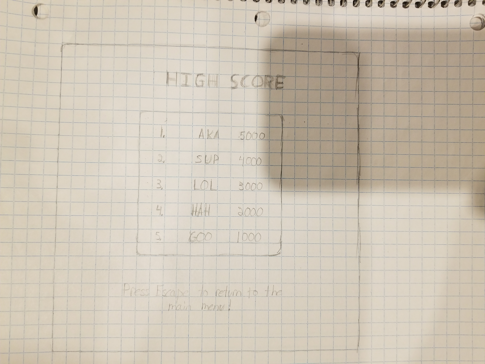

#### How To Play Screen
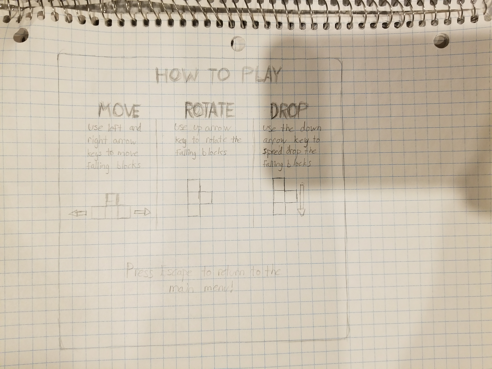

#### Main Game
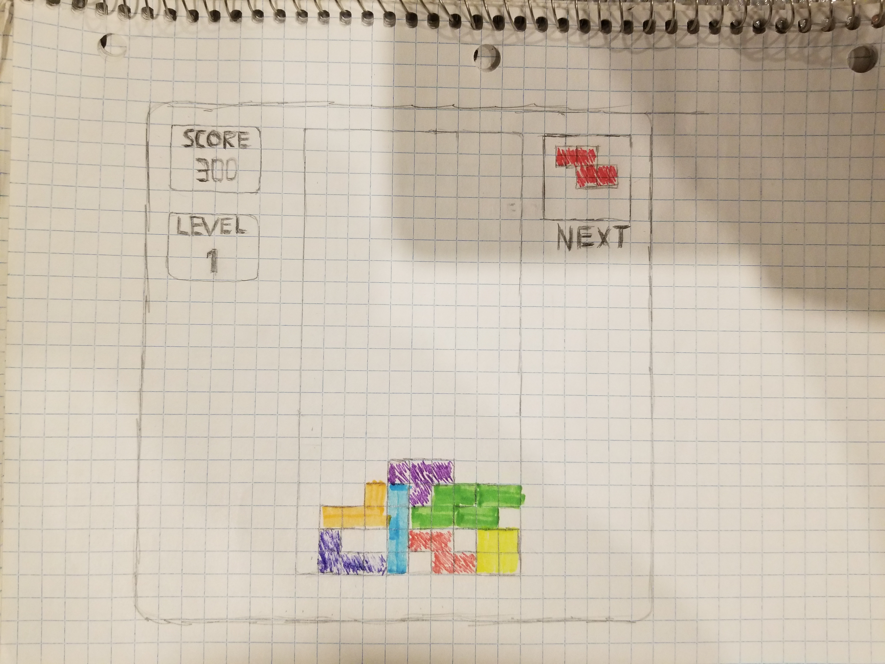

#### High Score Enter
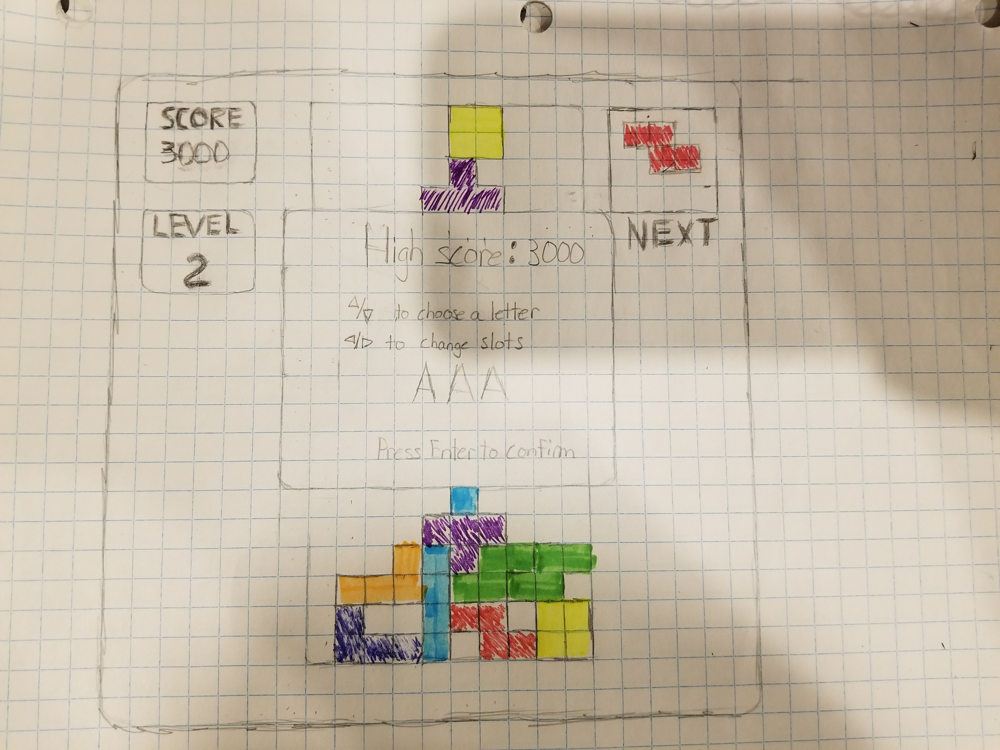

#### Game Over Screen
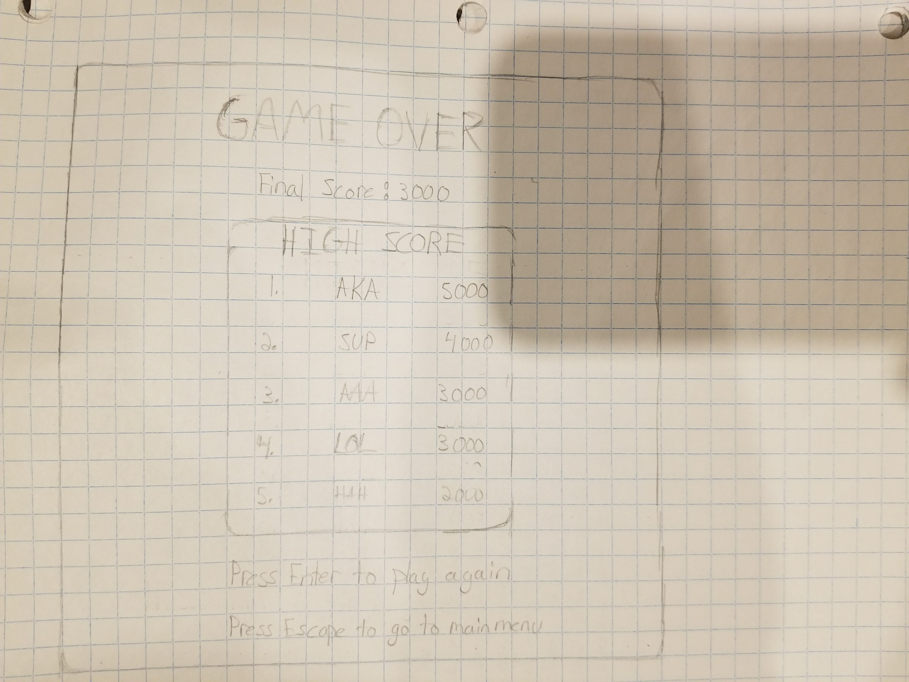

### 🎨 Assets

I hand drawn the wireframes to better reflect how the actual game will look like and to better show the UI and the functionality of the game.

I plan on mostly using assets from [itch](https://itch.io/) or [opengameart](https://opengameart.org/).

The GUI will be kept easy to use. There will be an option to learn how to play in the menu for new players.

#### 🖼️ Images

These are mostly the images that will be used:

**Blocks:**   
 
 
 
 

**Game Frame**    
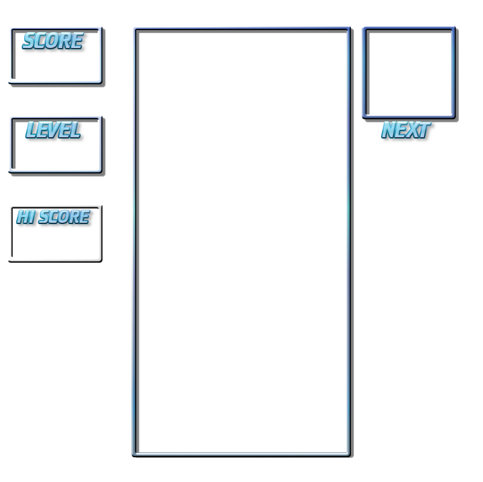

**Backgrounds**    
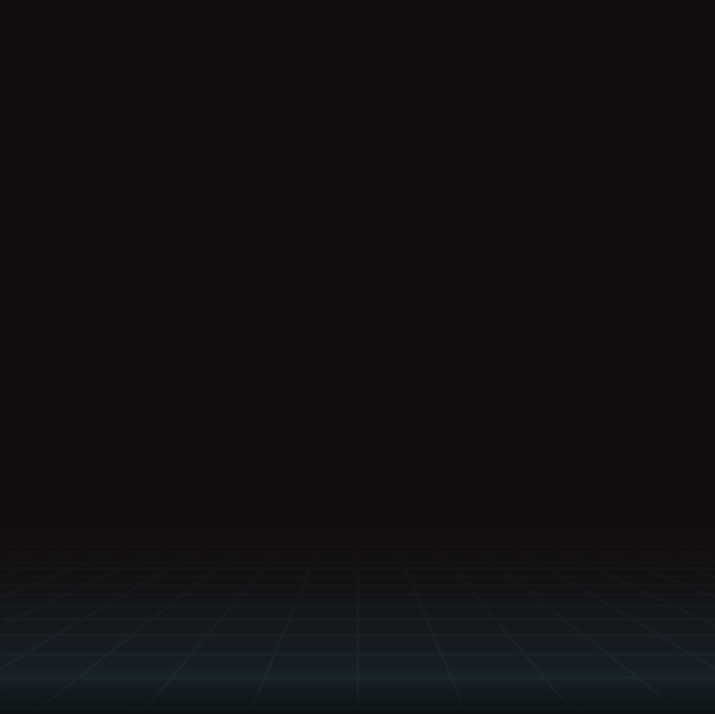
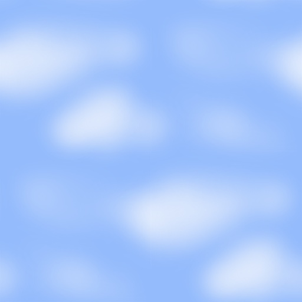

**Title Image**    
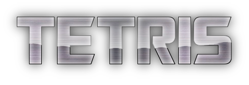

More images might be used during the implentation.

All of the above images are from the following sources
- [Sky background - opengamemart.org](https://opengameart.org/content/cartoony-sky)
- [Blocks, frame, grid background, title image - itch.io](https://fab08.itch.io/tetris)

#### ✏️ Fonts

For fonts, a retro gaming type font will be used for most of the text. A more bold and darker font might also be used for some parts. The Minecraft Evenings font might also be used since it give block like feeling.

- [Joystix](./fonts/Joystix.ttf)
- [Tank](./fonts/tank.ttf)
- [Minecraft Evenings](./fonts/Minecraft Evenings.otf)

#### 🔊 Sounds

Menu, Line removal and Shape placed sounds were taken from [https://fab08.itch.io/tetris](https://fab08.itch.io/tetris).
Game background music was taking from [freesound.org](https://freesound.org/people/BloodPixelHero/sounds/580898/)

- [Menu background](./sounds/menu.ogg)
- [Line removal](./sounds/explosion.wav)
- [Shape placed](./sounds/shapePlace.wav)
- [Game background](https://freesound.org/people/BloodPixelHero/sounds/580898/)

### 📚 References

- [Tetris game](https://tetris.com/play-tetris)
- [Itch.io - Tetris](https://fab08.itch.io/tetris)
- [Tetris Wiki](https://en.wikipedia.org/wiki/Tetris)

